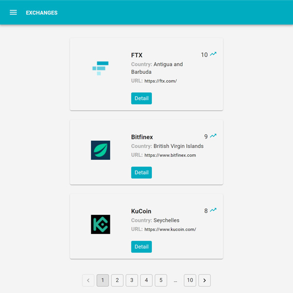

### Coingecko Exchange
[ Developed by Eaglex ](http://eaglex.net)


#### About
React with Mobx application showing bitcoin exchanges in a paged list with view to each bitcoin product detail.

- Using coingecko api, documentation on `https://www.coingecko.com/api/documentations/v3#/`
- React stateless application
- Mobx Store
- App routing
- Mobx state handling
- Tests and Coverage provided
- React Material and Bootstrap 
- Mobile optimized

<br>

### <span style="color:red">Latest updates</span>

<i>Project demo is now available on github pages: </i>
[ >> coingecko-exchange <<](https://eag1ex.github.io/coingecko-exchange/)

<br>


<br>
<br>

#### Install 
Build in `Node.js 12.0.0` and `NPM 6.9.0` in strict mode, maybe supported on higher, but not tested

```sh
/$ npm i 
```


#### Start
Opens in http://localhost:3000/

```sh
/$ npm start
```


### Demo
Live demo available behind login:

```sh
## OLD, INACTIVE
# https://hidden-forest-35005.herokuapp.com/login
# login: eaglex
# password: eaglex
```
- session times out, its a free dyno, may take time initially


#### Production
To test production mode, execute  `npm run build` then install static server with `npm install -g serve`
and finally execute `serve -s build`


#### Stack
Application stack: `React v16, Mobx v6, es6, MVC, React Material (configurable), Bootstrap (configurable), x-utils-es, Javascript, Jest, nyc/instanbul, scss`


#### Tests
Running tests:
- Test files are located in `./src/__tests__` and `./src/setupTests.js`
- You can access coverage from `./coverage/lcov-report/index.html`
- Performing tests requires access to `coingecko api`

```sh
/$ npm run test # only test
/$ npm run coverage # runs test with coverage
```


#### Code Hierarchy
- App
- Components
- Pages
    - Exchange
    - ProductDetail

- Store
    - api `(list of available apis)`
    - Mobx `(store and state manager)`
- Theme `(scss and React Material)` 
- Utils


#### Api
This application consumes 2 (GET) apis: `https://api.coingecko.com/api/v3/exchanges/` and `https://api.coingecko.com/api/v3/exchanges/{id}`

- Refer to docs: `https://www.coingecko.com/api/documentations/v3#/`


#### Troubleshooting
Having issues with fetch, taking too long to load the results, in chrome on windows just run this in Command Prompt CLI:
`C:\Program Files (x86)\Google\Chrome\Application\chrome.exe" --disable-web-security --user-data-dir="C:\temp`

#### Create-react-app readme:
To know more about `npx create-react-app my-app` please read on here:
`https://github.com/facebook/create-react-app/blob/master/README.md`


#### Sass
- Sass/scss: the `.env` file needs to be adjusted depending on your OS environment, as per instructions in: `https://create-react-app.dev/docs/adding-a-sass-stylesheet`
- got some warnings, try running `npm rebuild node-sass --force`


##### LICENSE
* LICENSE: CC BY-NC-ND
* SOURCE: https://creativecommons.org/licenses/by-nc-nd/4.0/legalcode

##### Thank you

